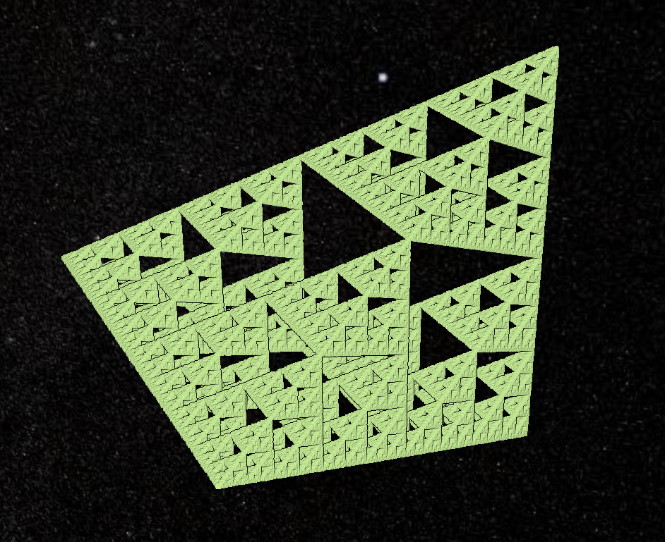

## Chaos Game 3D (2019-2020, 2021)



This program can be used to generate fractals using the Chaos Game as a
3D point cloud. The input are JSON parameter files, and the output is a
3D Tiles point cloud tileset.

The `viewer/` subdirectory contains a small static page one can use to view
the output.

### Usage

Generating fractals:

```
cargo run PARAMETER_FILE OUTPUT_DIRECTORY
```

Where: 

* PARAMTER_FILE is a JSON file describing the fractal (see the `params/`
    directory for examples)
* OUTPUT_DIRECTORY is the name of the directory where the tileset will be
    created. This directory will be created as needed.

Viewer:

* Generate fractals in `viewer/fractal_name`
* Make sure `viewer/index.html` is updated to list the new fractals
* Run the `viewer` directory as a static site (e.g. via `http-server` (Node.js)
    or `python -m http.server`)