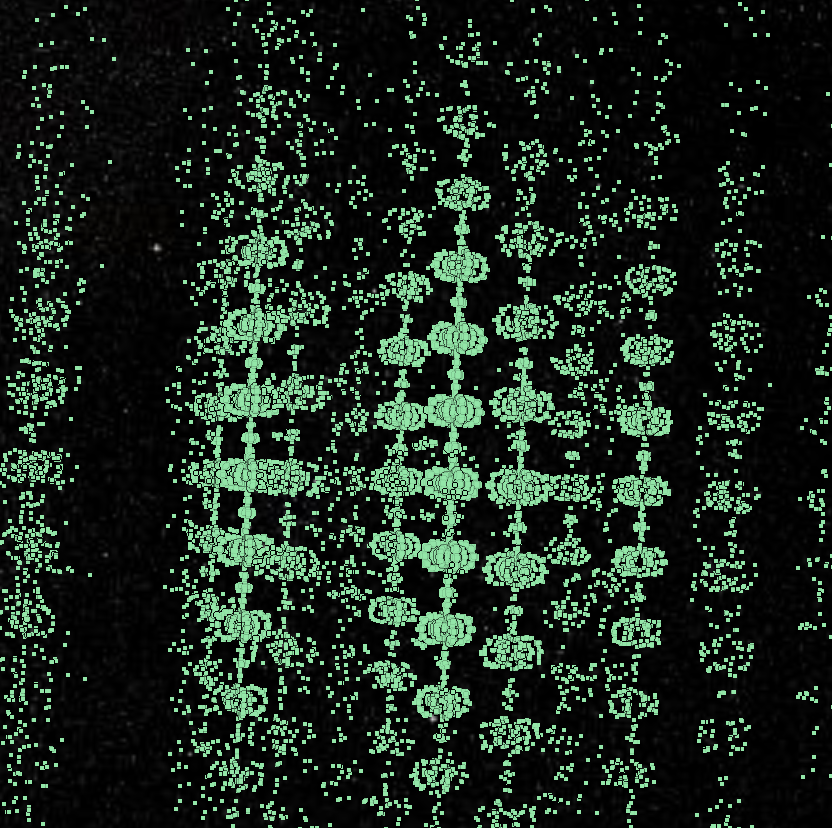
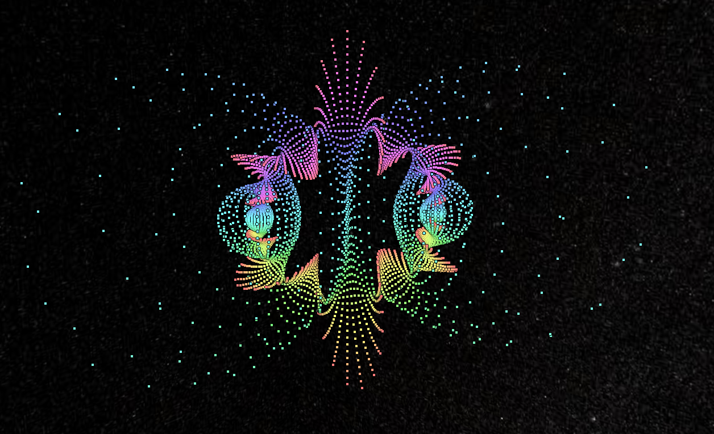
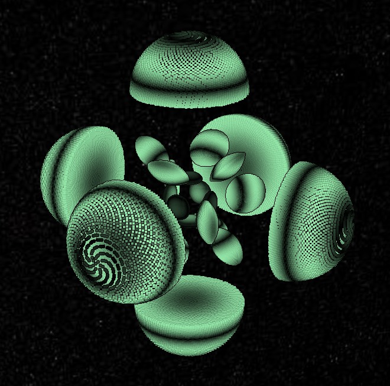
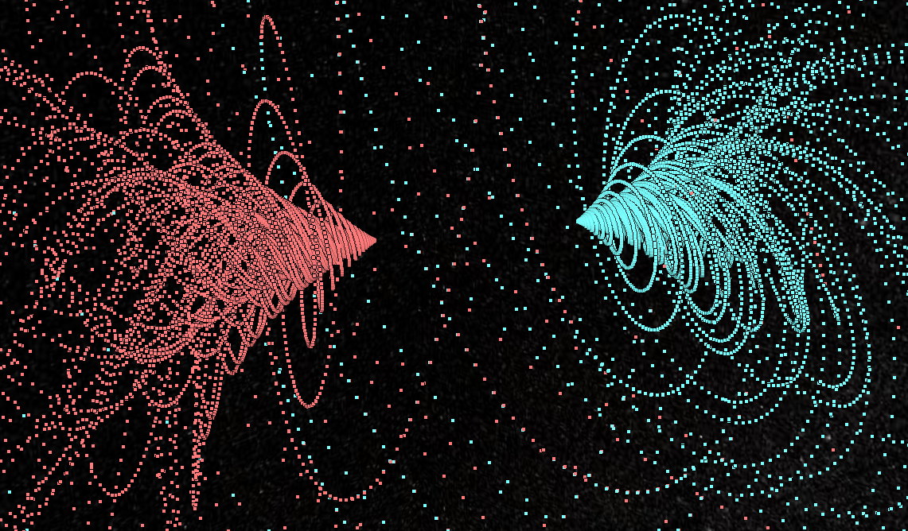

## Chaos Game 3D (2019-2020, 2021-2022)


This program can be used to generate fractals using the Chaos Game as a
3D point cloud. The input are JSON parameter files, and the output is a
3D Tiles point cloud tileset.

The `viewer/` subdirectory contains a small static page one can use to view
the output.

### Full Disclosure

This project uses [3D Tiles](https://github.com/CesiumGS/3d-tiles) and
[CesiumJS](https://github.com/CesiumGS/cesium) I am a Cesium employee, and
a clause in my employment contract requires me to assign any related innovations
to the company. Thus, this project is licensed under the Apache license, and
the copyright belongs to Cesium GS, Inc.

### Gallery

These images correspond to some of the parameter files found in `params/`

|||
|---|---|
| `sierpinski` | `bent_sierpinski` |
|  |  |
| `grid_3d` | `seaweed` |
|  |  |
| `spiky_ball` | `discrete_gyroid_surface` |
|  |  |
| `loxodromic` | `pillows` |
|  |  |
| `hopf_fibration` | Animated |
|  | |
| `torus_knots` | Animated |
|  |  |
| `aa_loxodromic` | Animated |
|  | 

### Usage

Generating fractals:

```
cargo run PARAMETER_FILE
```

Where: 

* PARAMTER_FILE is a JSON file describing the fractal (see the `params/`
    directory for examples)

The script will create a new directory `viewer/<fractal_id>` containing the
fractal as a 3D Tiles tileset. The fractal ID comes from the `id` property
from the paramters JSON file.

Viewer:

* Generate fractals in `viewer/<fractal_id>`
* From the `viewer/` directory, run  `python make_index.py` to generate 
    `fractals.json`. This is a list of fractal names, IDs and descriptions
    pulled from the tileset JSON files (`viewer/<fractal_id>/tileset.json`).
    This only works for newer GLB fractals.
* Run the `viewer` directory as a static site (e.g. via `http-server` (Node.js)
    or `python -m http.server`)